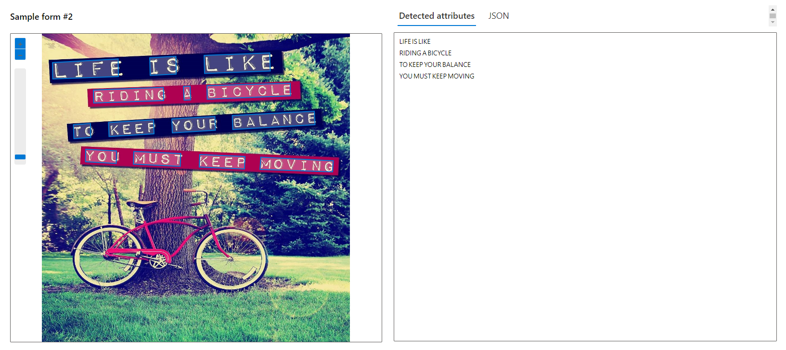
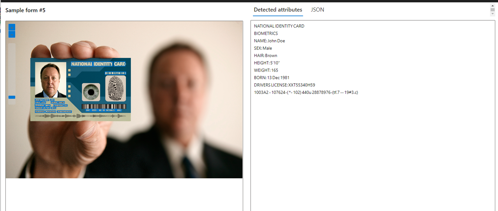

__Laboratório de OCR com Azure Cognitive Services__
Este repositório contém os recursos e o código-fonte para um laboratório prático de Reconhecimento Óptico de Caracteres (OCR) utilizando os Azure Cognitive Services. O OCR é uma técnica poderosa para extrair texto de imagens ou documentos digitalizados, e os Azure Cognitive Services oferecem uma solução robusta e escalável para implementar essa funcionalidade em seus aplicativos.

**Objetivo**
O objetivo deste laboratório é demonstrar como utilizar os Azure Cognitive Services para realizar OCR em imagens e extrair o texto correspondente. Ao seguir este guia, você aprenderá a configurar um ambiente de desenvolvimento, integrar os serviços cognitivos da Microsoft em seu aplicativo e realizar OCR em imagens de forma eficiente.

__Pré-requisitos__
Conta ativa no Microsoft Azure
Acesso ao portal do Azure
Conhecimento básico de desenvolvimento de aplicativos
Configuração do Ambiente
Criar uma Instância de Serviço Cognitivo: No portal do Azure, crie uma instância de Serviço Cognitivo. Selecione o tipo de serviço como "Visão" para habilitar as capacidades de OCR.

Obter Chave e URL: Após criar a instância do Serviço Cognitivo, obtenha a chave e o URL de endpoint. Estes serão necessários para autenticar e acessar os serviços.

Instalar Dependências: Certifique-se de ter as dependências necessárias instaladas em seu ambiente de desenvolvimento. Você pode precisar instalar bibliotecas ou SDKs específicos dependendo da linguagem de programação que estiver utilizando.

Executando o Laboratório
Integrar o SDK: Utilize o SDK fornecido pela Microsoft para integrar os Azure Cognitive Services em seu aplicativo. Importe as bibliotecas necessárias e configure a autenticação utilizando a chave e o URL de endpoint obtidos anteriormente.

Enviar Imagens para OCR: Envie as imagens que deseja processar para o serviço de OCR. Certifique-se de escolher o método adequado para enviar os dados da imagem, seja via URL ou upload do arquivo.

Processar Resultados: Após enviar a imagem, o serviço retornará o texto extraído. Manipule esses resultados conforme necessário em seu aplicativo.

Gerenciar Erros e Exceções: Implemente tratamento de erros adequado para lidar com situações como falhas na conexão, imagens de baixa qualidade ou problemas de autenticação.

__Recursos Adicionais__
Documentação dos Azure Cognitive Services:

https://learn.microsoft.com/en-us/azure/ai-services/computer-vision/concept-ocr

